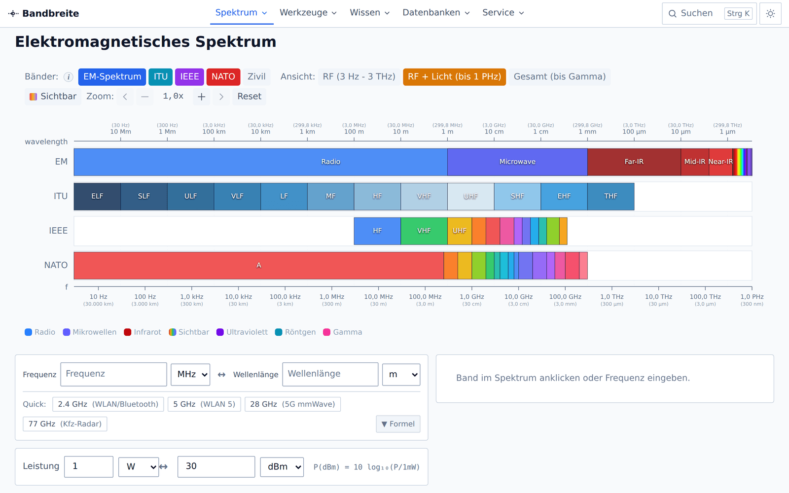

# Bandbreite

[](https://bandbreite.online-resources.de)

Eine Web-Anwendung rund um das elektromagnetische Spektrum: interaktive Visualisierungen, Rechner für die Hochfrequenztechnik, Lehrtexte zur Funk- und Fernmeldetechnik und durchsuchbare Frequenzdatenbanken. Entwickelt für Ingenieure, Techniker, Funkamateure und alle, die wissen wollen, wer welche Frequenz nutzt und warum.


*Interaktive Visualisierung des elektromagnetischen Spektrums mit ITU-, IEEE- und NATO-Bandbezeichnungen*

## Features

### Spektrum

- **Spektrum-Dashboard** — das gesamte EM-Spektrum von ELF bis Gammastrahlung, logarithmisch, mit Zoom, Frequenz-/Wellenlängen-Cursor und Banddetail-Seitenleiste
- **Anwendungen im Spektrum** — welcher Dienst nutzt welches Band: Rundfunk, Mobilfunk, Radar, Satellit, WLAN
- **Sendeleistungen** — typische Sendeleistungen über der Frequenz aufgetragen
- **Atmosphärische Dämpfung** — Sauerstoff- und Wasserdampflinien nach ITU-R P.676-13 (line-by-line), Regen (P.838-3), Nebel und Wolken (P.840), Schnee, mit einstellbaren Atmosphärenparametern
- **Ionosphärische Ausbreitung** — D-, E- und F-Schichten, MUF/LUF, Skip-Zone

### Rechner und Konverter

Alle Rechner halten ihren Zustand in der URL (`?f=…&d=…`) und bieten „Link kopieren" und „Zurücksetzen".

- **Freiraumdämpfung (FSPL)** mit Mehrfrequenz-Vergleich
- **Link-Budget** mit Wasserfall-Diagramm, Schwundreserve und Erde–Raum-Pfad
- **Radar-Reichweite** nach der Radargleichung, inkl. Doppler, Auflösung und eindeutiger Entfernung
- **Kanalkapazität** nach Shannon-Hartley mit Grenzkurve
- **Skin-Tiefe** inkl. Gültigkeitsprüfung der Guter-Leiter-Näherung
- **Fresnel-Zone** mit Hindernisfreiheit und Messerschneiden-Dämpfung
- **Frequenz ↔ Wellenlänge** und **Leistungsumrechnung** (W ↔ mW ↔ dBm ↔ dBW)

### Wissen — Funk- und Fernmeldetechnik

Kapitel mit Lernzielen, Inhaltsverzeichnis, Formeln und eingebetteten interaktiven Widgets:

- **Wellenausbreitung** — Bodenwelle, Raumwelle, Sichtverbindung, Beugung
- **Funk & Fernmeldetechnik** — ITU-Funkdienste und Frequenzplan, Amateurfunk (Bandplan-Visualisierer über 22 Bänder), Mobilfunk (1G bis 6G, Bandtabelle, Datenraten-Rechner), Rundfunk (LW bis DVB-T2, Kanalumrechner) sowie Not- und Sicherheitsfrequenzen
- **Modulation** — AM/FM/PM und ASK/FSK/PSK/QAM mit Wellenform- und Spektrumanzeige, Konstellationsdiagramm mit Rauschen, Carson-Rechner
- **Antennen** — Polardiagramm (Dipol, Gruppe, Yagi, Parabol), Parabolgewinn, SWR
- **HF-Mathematik** — die wichtigsten Formeln mit Herleitung und Rechenbeispielen
- **Radar-Grundlagen** — Impulsdiagramm, RCS-Vergleich, Doppler-Widget

Interaktive Widgets respektieren `prefers-reduced-motion`, lassen sich pausieren und liefern zu jeder Grafik eine Datentabelle für Screenreader.

### Datenbanken

- **Frequenzbänder** — ITU, IEEE, NATO sowie Amateurfunk- und Rundfunkbänder mit Eigenschaften und Anwendungen
- **Funkdienste** — Frequenzzuweisungen, filterbar nach Kategorie, Region und Frequenzbereich
- **Senderdatenbank** — Zeitzeichen-, Rundfunk-, Navigations- und Forschungssender mit Frequenz, Leistung und Standort
- **Fernmeldegeschichte** — Zeitleiste von der Telegrafie bis 5G

### Bedienung

- **Command-Palette** (`Strg`/`⌘` + `K`) — Volltextsuche über Seiten, Bänder, Dienste und Sender, dazu ein Frequenz-Modus: „2,4 GHz" findet passende Bänder, Dienste und Rechner-Deep-Links
- **Mega-Menü und Mobile-Schublade** aus einer einzigen Navigations-Registry
- **Verwandte Themen** am Ende jeder Seite
- **Hell / Dunkel / System** als Farbschema
- **Tastaturbedienbar**, mit Sprunglink, Fokusring und Textalternativen zu allen Diagrammen

## Installation

```bash
git clone https://github.com/hnsstrk/bandbreite.git
cd bandbreite
npm install
npm run dev -- --open
```

## Tech Stack

- **Framework**: SvelteKit (Svelte 5, Runes), statisch vorgerendert über `adapter-static`
- **Styling**: Tailwind CSS 4 mit eigenem Token-System (`src/app.css`)
- **Visualisierungen**: D3 (Skalen und Pfadgeneratoren) plus eigenes SVG — kein Chart.js
- **Testing**: Vitest mit jsdom
- **Package Manager**: npm

## Entwicklung

```bash
npm run dev          # Entwicklungsserver starten
npm run build        # Produktions-Build
npm run preview      # Build-Vorschau
npm run check        # TypeScript/Svelte-Prüfung
npm run test         # Unit-Tests (Watch-Modus)
npm run test:run     # Unit-Tests einmalig
npm run test:coverage
```

Vor jedem Commit: `npm run check && npm run test:run && npm run build` — 0 Fehler, alle Tests grün.

## Projektstruktur

```
src/
├── lib/
│   ├── components/
│   │   ├── layout/       # Header, Mega-Menü, Mobile-Menü, Command-Palette, Theme
│   │   ├── ui/           # Design-System: Button, Card, NumberInput, Tabs, …
│   │   ├── calculators/  # Rechner + Logikmodule (*.svelte.ts)
│   │   ├── converters/   # Frequenz-, Leistungs-, Reichweiten-Konverter
│   │   ├── charts/       # D3-Diagramme, alle in ChartFrame
│   │   ├── funk/         # Bandpläne, Kanalumrechner, Funkdienst-Datenbank
│   │   ├── knowledge/    # Kapitel-Renderer, Widget-Rahmen, Animationsschleife
│   │   └── widgets/      # Interaktive Widgets + Rechenmodelle
│   ├── content/          # Kapiteltexte als Daten (kein Markup)
│   ├── data/             # Frequenz- und Banddaten, Navigation, Konstanten
│   ├── stores/           # Globaler Zustand (Lichtgeschwindigkeit, Atmosphäre)
│   └── utils/            # Berechnungen, Formatierung, Suche, URL-Zustand
├── routes/               # SvelteKit-Seiten (34 Seiten + 3 Redirects)
└── tests/                # Unit-Tests (37 Dateien, 1597 Tests)
static/                   # Icons, Manifest, Screenshot, Service-Worker
```

Ausführliche Elementreferenz mit stabilen IDs: **[ARCHITEKTUR.md](ARCHITEKTUR.md)**.
Design-System und Komponenten-Props: **[STYLE_GUIDE.md](STYLE_GUIDE.md)**.
Deployment: **[docs/DEPLOYMENT.md](docs/DEPLOYMENT.md)**.

## Datenstruktur

Die Anwendung trennt bewusst zwischen physischen Sendern, Frequenzzuweisungen und Bandschemata.

### Senderdatenbank (`data/transmitters.json`, 37 Einträge)

**Physische Einzelsender** an konkreten Standorten.

| Feld | Beschreibung |
|------|--------------|
| `id` | Eindeutige ID (z. B. „dcf77") |
| `frequencyHz` | Exakte Sendefrequenz in Hz |
| `location` | Standort mit Koordinaten |
| `powerWatts` | Sendeleistung |
| `operator` | Betreiber |
| `status` | aktiv / inaktiv |

**Beispiele:** DCF77 (77,5 kHz, Mainflingen), MSF (60 kHz, Anthorn), WWVB (60 kHz, Fort Collins).

Zeitzeichensender sind ausschließlich hier definiert — sie sind Einzelsender mit festem Standort, keine Frequenzbänder.

### Anwendungsdatenbank (`data/applications.json`, 105 Einträge)

**Frequenzbänder und -zuweisungen** verschiedener Dienste.

| Feld | Beschreibung |
|------|--------------|
| `id` | Eindeutige ID (z. B. „wifi-2.4ghz") |
| `minHz` / `maxHz` | Frequenzbereich |
| `category` | Dienst-Kategorie (12 Kategorien) |
| `region` | Gültigkeitsregion |
| `standard` | Technischer Standard (optional) |

**Beispiele:** WLAN 2,4 GHz (2400–2483,5 MHz), LTE-Band 20, GPS L1.

Hier stehen nur echte Frequenzbereiche mit `minHz !== maxHz`. Einzelfrequenzen gehören in `transmitters.json`.

### Abgrenzung

```
transmitters.json         applications.json
─────────────────         ──────────────────
Physischer Sender    vs.  Frequenzzuweisung
Einzelfrequenz       vs.  Frequenzbereich
Konkreter Standort   vs.  Regionale Allokation
Betreiber bekannt    vs.  Nutzungsart definiert
```

### Datensätze in `src/lib/data/`

| Datei | Inhalt |
|-------|--------|
| `navigation.ts` | Navigations-Registry (34 Knoten) — Single Source of Truth für alle Seiten |
| `relations.ts` | „Verwandte Themen": 3–6 Verweise je Seite, Rückverweise automatisch |
| `searchIndex.ts` | Suchindex der Command-Palette (271 Einträge in 6 Gruppen) |
| `bands.ts` | ITU-, IEEE-, NATO-, Zivil- und Altbänder (123 Bänder) |
| `frequencyBands.ts` | Banddatenbank mit Eigenschaften und Anwendungen (72 Bänder) |
| `spectrum.ts` | Spektrumgrenzen, sichtbares Licht, Chart-Bereiche |
| `constants.ts` | Physikalische Konstanten, Ionosphärenschichten, Absorptionspeaks, RCS-Referenzen |
| `units.ts` | Einheiten und Umrechnungsfaktoren (Frequenz, Wellenlänge, Leistung, Distanz) |
| `presets.ts` | Voreinstellungen für Rechner und Diagramme |
| `explanations.ts` | Deutsche Tooltiptexte und Formelerklärungen |
| `propagation.ts` | Ausbreitungsmodi, Radiohorizont, Sprungdistanz, MUF |
| `itu676Lines.ts` | Linienkatalog ITU-R P.676-13: 44 O₂- und 35 H₂O-Linien |
| `radioServices.ts` | 18 ITU-Funkdienste mit 79 Zuweisungen |
| `amateurBands.ts` | 22 Amateurfunkbänder mit 86 Betriebsartensegmenten |
| `mobileNetworks.ts` | 6 Mobilfunkgenerationen und 13 Bänder (UL/DL, Duplex) |
| `broadcast.ts` | Rundfunkbereiche, 15 Kurzwellenbänder, 32 DAB-Blöcke, 28 DVB-T2-Kanäle |
| `emergencyFrequencies.ts` | 27 Not-, Anruf- und Sicherheitsfrequenzen (See, Luft, Land, Satellit) |
| `modulation.ts` | 16 Modulationsverfahren mit Kennwerten |
| `antennas.ts` | 10 Antennentypen mit Gewinn, Polarisation und Bauform |
| `history.ts` | 48 Meilensteine der Fernmeldetechnik |

## Quellen und Haftungsausschluss

> **Bandbreite ist keine amtliche Quelle und kein Betriebsdokument.**
> Frequenzangaben, Bandgrenzen, Leistungsgrenzen und Kanaltabellen sind nach bestem Wissen zusammengetragen, ersetzen aber keine amtliche Veröffentlichung. Für Antragstellung, Funkbetrieb, Navigation, Not- und Sicherheitsfunk sowie jede rechtliche Bewertung gelten ausschließlich die Primärquellen in ihrer jeweils gültigen Fassung.
>
> Rechenergebnisse beruhen auf den jeweils genannten Modellen und geben Größenordnungen wieder; die tatsächlichen Werte einer Funkstrecke hängen von Gelände, Bebauung, Wetter und Gerätetechnik ab.

Die Seite **[/service/quellen/](https://bandbreite.online-resources.de/service/quellen/)** listet alle Regelwerke (VO Funk, BNetzA-Frequenzplan, AFuV, IARU-Bandpläne, GMDSS, ICAO Annex 10), technischen Normen (ITU-R P.525/P.676/P.838/P.840, 3GPP, ETSI, IEEE Std 521) und die bekannten Unsicherheiten je Datensatz. Dieselben Angaben in Kurzform: **[docs/DATENQUELLEN.md](docs/DATENQUELLEN.md)**.

## Lizenz

Dieses Projekt steht unter der [MIT License](LICENSE).
