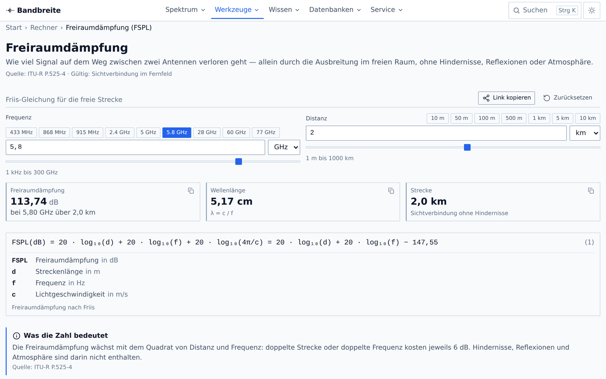
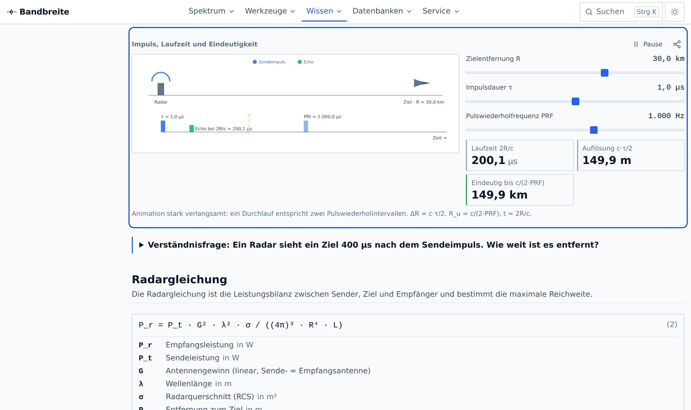
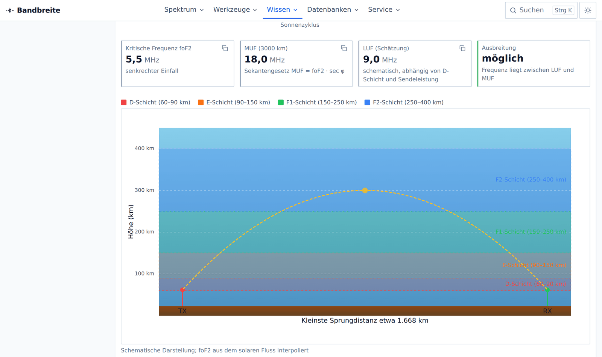
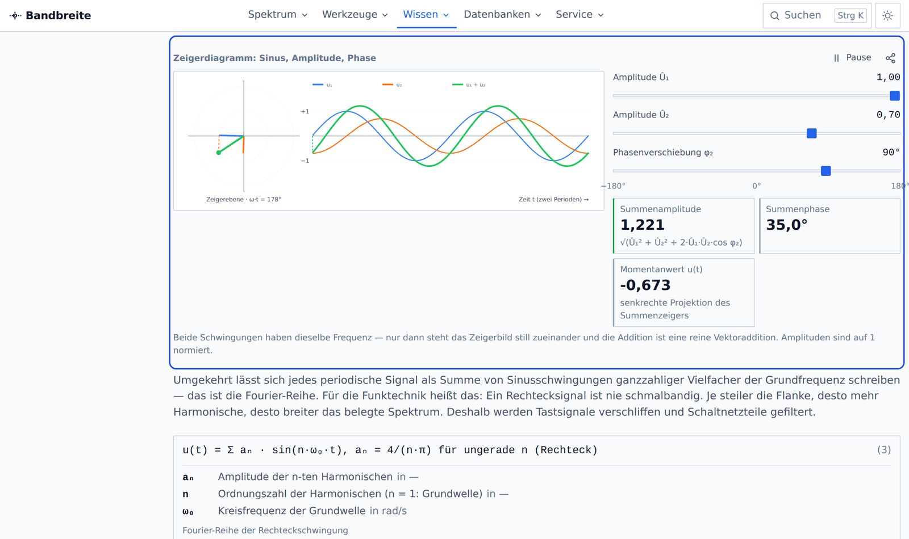
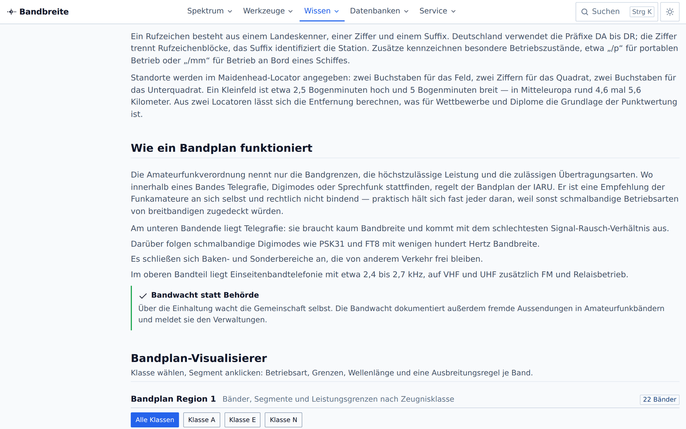
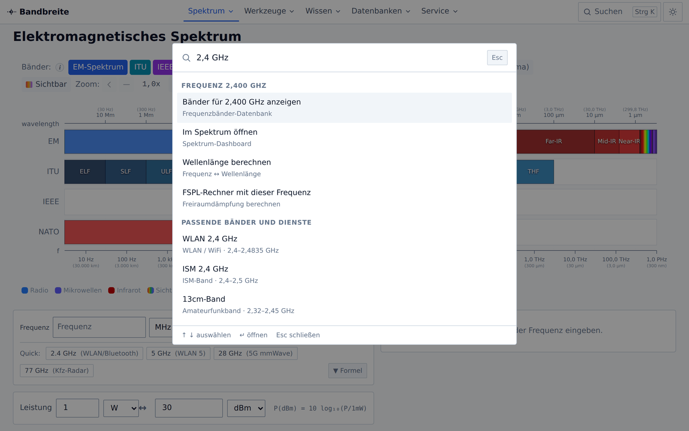
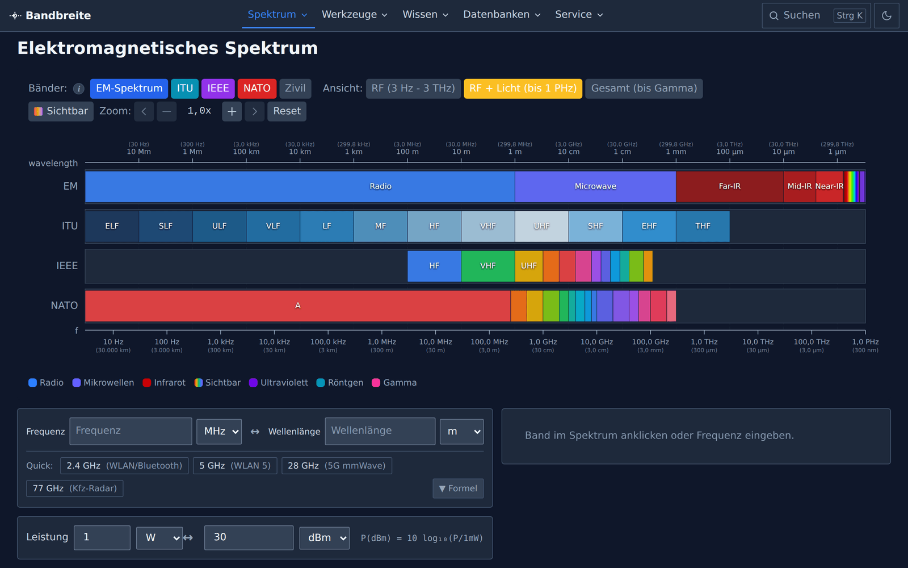

# Bandbreite

[](https://bandbreite.online-resources.de)

Eine Web-Anwendung rund um das elektromagnetische Spektrum: interaktive Visualisierungen, Rechner für die Hochfrequenztechnik, Lehrtexte zur Funk- und Fernmeldetechnik und durchsuchbare Frequenzdatenbanken. Entwickelt für Ingenieure, Techniker, Funkamateure und alle, die wissen wollen, wer welche Frequenz nutzt und warum.


*Das Spektrum-Dashboard: alle Bänder von ELF bis Gammastrahlung, logarithmisch, mit ITU-, IEEE- und NATO-Bandbezeichnungen, Zoom und Frequenzmarker — schlicht wie ein Datenblatt und über die volle Fensterbreite*

## Features

### Portal

- **Startseite `/`** — Einstieg mit Suchfeld über die volle Breite, den fünf Bereichen als Linkzeilen, den vier Lernpfaden, den interaktiven Kapiteln und der vollständigen Werkzeugliste — alles als dichte Listen mit Trennlinien, keine Kachelraster

### Spektrum

- **Spektrum-Dashboard** — das gesamte EM-Spektrum von ELF bis Gammastrahlung, logarithmisch, mit Zoom, Frequenz-/Wellenlängen-Cursor und Banddetail-Seitenleiste; das Diagramm steht ohne Rahmen direkt unter der Überschrift und nutzt die volle Fensterbreite, ein Klick auf ein Band setzt die Frequenz für alle Werkzeuge darunter
- **Anwendungen im Spektrum** — welcher Dienst nutzt welches Band: Rundfunk, Mobilfunk, Radar, Satellit, WLAN
- **Sendeleistungen** — typische Sendeleistungen über der Frequenz aufgetragen

### Rechner und Konverter

Alle neun Rechner halten ihren Zustand in der URL (`?f=…&d=…`) und bieten „Link kopieren" und „Zurücksetzen".

- **Freiraumdämpfung (FSPL)** mit Mehrfrequenz-Vergleich
- **Link-Budget** mit Wasserfall-Diagramm, Schwundreserve und Erde–Raum-Pfad
- **Radar-Reichweite** nach der Radargleichung, inkl. Doppler, Auflösung und eindeutiger Entfernung
- **Kanalkapazität** nach Shannon-Hartley mit Grenzkurve
- **Skin-Tiefe** inkl. Gültigkeitsprüfung der Guter-Leiter-Näherung
- **Fresnel-Zone** mit Hindernisfreiheit und Messerschneiden-Dämpfung
- **Antennengewinn** — Parabolgewinn, Halbwertsbreite, Wirkfläche, Fernfeldabstand, dBi ↔ dBd
- **Radiohorizont** — Sichtweite über der Erdkrümmung mit einstellbarem k-Faktor
- **Dezibel-Rechner** — Verhältnisse, Absolutpegel (dBm/dBW/dBµV) und eine sechsstufige Pegelkette
- **Konverter** — Frequenz ↔ Wellenlänge mit Bandzuordnung, dazu Leistungsumrechnung (W ↔ mW ↔ dBm ↔ dBW) und Reichweitenschätzung auf dem Dashboard


*Jeder Rechner zeigt Eingabe, Ergebnis und Formel auf einer Seite, ohne Rahmen um die Abschnitte — der Zustand steht in der URL und lässt sich teilen*

### Wissen

Kapitel mit Lernzielen, Inhaltsverzeichnis, Formeln und eingebetteten interaktiven Widgets:

- **Lernpfade** — vier geführte Reihenfolgen quer durch die Kapitel („Vom Spektrum zur Funkverbindung", „Radar verstehen", „Funkdienste kennenlernen", „Amateurfunk-Einstieg") mit Schrittleiste und gerätelokalem Fortschritt
- **Grundlagen** — EM-Wellen (E-/H-Feld, λ = c/f, Nah- und Fernfeld, Polarisation), Dezibel (10·log vs. 20·log, dBm/dBW/dBµV, Pegelketten), Leistung und Pegel (EIRP/ERP, Leistungsdichte, Feldstärke)
- **Wellenausbreitung** — Bodenwelle, Raumwelle, Sichtverbindung, Beugung
  - **Ionosphärische Ausbreitung** — D-, E- und F-Schichten, MUF/LUF, Skip-Zone
  - **Atmosphärische Dämpfung** — Sauerstoff- und Wasserdampflinien nach ITU-R P.676-13 (line-by-line), Regen (P.838-3), Nebel und Wolken (P.840), Schnee, mit einstellbaren Atmosphärenparametern
- **Funk- und Fernmeldetechnik** — neun Unterkapitel: ITU-Funkdienste, Amateurfunk (Bandplan über 22 Bänder), Mobilfunk (1G bis 6G), Rundfunk (LW bis DVB-T2, Kanalumrechner), Seefunk und GMDSS, Flugfunk mit 8,33-kHz-Kanalrechner, BOS-Funk von analog zu TETRA, Satellitenfunk mit Orbit-Rechner sowie Not- und Sicherheitsfrequenzen
- **Radartechnik** — drei Unterkapitel: Grundlagen (Laufzeit, Radargleichung, RCS, Auflösung und Mehrdeutigkeit), Verfahren (Puls/CW/FMCW, MTI, Blindgeschwindigkeiten, Pulskompression, CFAR, Phased Array, SAR) und Sekundärradar (Modus A/C/S, ADS-B, TCAS)
- **Modulation** — AM/FM/PM und ASK/FSK/PSK/QAM mit Wellenform- und Spektrumanzeige, Konstellationsdiagramm mit Rauschen, Carson-Rechner
- **Antennen** — Polardiagramm (Dipol, Gruppe, Yagi, Parabol), Parabolgewinn, SWR
- **HF-Mathematik** — die wichtigsten Formeln mit Herleitung und Rechenbeispielen
- **Glossar** — 92 Begriffe in sieben Kategorien, filterbar, mit Verweisen in die Kapitel

Alle Zahlenbeispiele in den Texten werden aus denselben Utilities berechnet wie die Rechner — sie können also nicht auseinanderlaufen. Interaktive Widgets respektieren `prefers-reduced-motion`, lassen sich pausieren und liefern zu jeder Grafik eine Datentabelle für Screenreader.


*45 Widgets sind einzeln verlinkbar: `?w=radar-pulse` springt zum Widget, hebt es hervor und setzt den Fokus hinein*


*Animierte Ionosphärenschichten über 24 Stunden: Elektronendichte, kritische Frequenz foF2 und MUF folgen dem Sonnenstand*


*Zeigerdiagramm im Mathematik-Kapitel: zwei Schwingungen als rotierende Zeiger, ihre Summe als Vektoraddition*


*Der Bandplan-Visualisierer zeigt alle 22 Amateurfunkbänder mit Betriebsartensegmenten und den Leistungsgrenzen der Klassen A, E und N nach AFuV Anlage 1*

### Datenbanken

- **Frequenzbänder** — ITU, IEEE, NATO sowie Amateurfunk- und Rundfunkbänder mit Eigenschaften und Anwendungen
- **Funkdienste** — Frequenzzuweisungen, filterbar nach Kategorie, Region und Frequenzbereich
- **Senderdatenbank** — Zeitzeichen-, Rundfunk-, Navigations- und Forschungssender mit Frequenz, Leistung und Standort
- **Fernmeldegeschichte** — Zeitleiste von der Telegrafie bis 5G

### Bedienung

- **Command-Palette** (`Strg`/`⌘` + `K`) — Volltextsuche über Seiten, Widgets, Bänder, Dienste, Sender und Glossarbegriffe, dazu ein Frequenz-Modus: „2,4 GHz" findet passende Bänder, Dienste und Rechner-Deep-Links
- **Suchseite `/suche/`** — dieselben Treffer nach Typ gruppiert, mit Filter-Chips und Trefferzählern; die Palette führt am Ende ihrer Liste dorthin
- **Widget-Deep-Links** — `?w=<widget>` verlinkt jedes der 45 Widgets direkt; „Link zum Widget kopieren" sitzt im Widget-Rahmen
- **Mega-Menü und Mobile-Schublade** aus einer einzigen Navigations-Registry
- **Verwandte Themen** am Ende jeder Seite
- **Hell / Dunkel / System** als Farbschema
- **Tastaturbedienbar**, mit Sprunglink, Fokusring und Textalternativen zu allen Diagrammen

### Erscheinungsbild

Die Oberfläche ist bewusst **schlicht wie ein technisches Datenblatt**: keine Schatten, Ecken von 2 px
(Rahmen um Flächen höchstens 4 px), Gliederung allein über 1-px-Linien, ein einziges Akzentblau für
Links und aktive Zustände. Farbig sind nur die Daten — Bandreihen, Diagrammserien und der
Frequenzmarker.

Jede Seite nutzt die **volle Fensterbreite**: Kopfbereich (≤ 3 rem hoch, ohne Weichzeichner),
Brotkrumen als schlichte Textzeile, Inhalt und Fuß haben keine `max-width` mehr, seitlich bleiben
0,75 rem Rand. Das gilt ausdrücklich auch für Fließtext in den Wissen-Kapiteln — dort steht das
Inhaltsverzeichnis als schmale Spalte daneben, der Text füllt den Rest. Der Umschalter für das
Farbschema ist eine einzelne Schaltfläche, die hell → dunkel → System durchschaltet.

<p>
  
  
  
</p>

*Frequenzsuche in der Command-Palette, das Portal auf 390 px Breite und das Spektrum im dunklen Farbschema — alle Aufnahmen zeigen den aktuellen Datenblatt-Stil*

## Installation

```bash
git clone https://github.com/hnsstrk/bandbreite.git
cd bandbreite
npm install
npm run dev -- --open
```

## Tech Stack

- **Framework**: SvelteKit (Svelte 5, Runes), statisch vorgerendert über `adapter-static` (`strict: true`) — jede Seite liegt als fertiges HTML im Build
- **Styling**: Tailwind CSS 4 mit eigenem Token-System (`src/app.css`), hell/dunkel über `@custom-variant`
- **Visualisierungen**: `d3-scale` und `d3-shape` (nur diese beiden Teilpakete, kein `d3`-Metapaket) plus eigenes SVG — **kein Chart.js**, kein jsPDF, kein html2canvas
- **Testing**: Vitest mit jsdom, dazu `@testing-library/svelte` für die Komponententests
- **Laufzeitabhängigkeiten**: genau zwei (`d3-scale`, `d3-shape`) — alles andere ist Build- oder Testwerkzeug
- **Package Manager**: npm

## Entwicklung

```bash
npm run dev          # Entwicklungsserver starten
npm run build        # Produktions-Build
npm run preview      # Build-Vorschau
npm run lint         # ESLint + Prettier-Prüfung
npm run format       # Prettier schreibt
npm run check        # TypeScript/Svelte-Prüfung
npm run test         # Unit-Tests (Watch-Modus)
npm run test:run     # Unit-Tests einmalig
npm run test:coverage
npm run test:e2e     # Rauchtest über alle gebauten Seiten (Chromium nötig)
```

Vor jedem Commit: `npm run lint && npm run check && npm run test:run && npm run build` — 0 Fehler,
alle Tests grün. Dieselbe Kette läuft in GitHub Actions (`.github/workflows/ci.yml`) bei jedem Push
und Pull Request, der Rauchtest dort als eigener Job.

### Formatierung und Lint

Prettier ist verbindlich: zwei Leerzeichen Einrückung, einfache Anführungszeichen, Semikolons,
Zeilenlänge 100 (Svelte-Dateien 120, weil Markup breiter ist), keine nachgestellten Kommas.
Markdown formatiert Prettier bewusst **nicht** (`.prettierignore`) — die Dokumentation lebt von
handgesetzten Tabellen. ESLint (`eslint.config.js`, Flat Config) prüft Logik statt Stil; Warnungen
sind zugelassen und im Konfigurationskommentar begründet, **Fehler nicht**.

### Rauchtest lokal ausführen

`npm run test:e2e` startet `vite preview` auf einem freien Port und lädt jede prerenderte Seite aus
`build/` in Chromium — Desktop (1280 × 900) und Mobil (390 × 800), jeweils hell und dunkel. Geprüft
werden Status 200, genau eine `h1` je Seite, kein waagerechtes Überlaufen, fehlerfreie Konsole und
die Befehlspalette mit <kbd>Strg</kbd> + <kbd>K</kbd>.

```bash
npm run build
npx playwright install chromium   # einmalig; --with-deps auf frischen Linux-Systemen
npm run test:e2e
```

Ist bereits ein Chromium vorhanden, genügt der Pfad statt der Installation:
`PLAYWRIGHT_CHROMIUM=/pfad/zu/chromium npm run test:e2e`. Eine Playwright-Installation außerhalb des
Projekts lässt sich über `PLAYWRIGHT_PATH=/pfad/zu/playwright/index.mjs` einbinden.

## Projektstruktur

```
src/
├── lib/
│   ├── components/
│   │   ├── layout/       # Header, Mega-Menü, Mobile-Menü, Command-Palette, Theme
│   │   ├── ui/           # Design-System: Button, Card, NumberInput, Tabs, …
│   │   ├── calculators/  # die neun Rechner + Logikmodule (*.svelte.ts)
│   │   ├── converters/   # Frequenz-, Leistungs-, Reichweitenkonverter, Bandzuordnung
│   │   ├── charts/       # Diagramme (d3-scale/d3-shape), alle in ChartFrame
│   │   ├── funk/         # Bandpläne, Kanalumrechner, Orbit-Rechner, Funkdienst-Datenbank
│   │   │                 #   Panel.svelte = flacher Abschnittsrahmen dieser Bausteine
│   │   ├── knowledge/    # Kapitel-Renderer, Widget-Rahmen, Animationsschleife
│   │   ├── widgets/      # interaktive Widgets + reine Rechenmodelle
│   │   ├── portal/       # Bausteine der Startseite; HubList.svelte = Linkliste aller Hubs
│   │   ├── learning/     # Lernpfad-Leiste, Pfad- und Schrittlisten, Fortschritt
│   │   └── Spectrum*     # das Spektrum-Diagramm und seine Teilkomponenten
│   ├── content/          # Kapiteltexte als Daten (kein Markup), inkl. radar/ und grundlagen/
│   ├── data/             # Frequenz- und Banddaten, Navigation, Glossar, Lernpfade, Widgets
│   ├── stores/           # Globaler Zustand (Lichtgeschwindigkeit, Atmosphäre)
│   └── utils/            # Berechnungen, Formatierung, Pegel, Bahnmechanik, Suche, URL-Zustand
├── routes/               # SvelteKit-Seiten (56 Seiten + 4 Redirects)
└── tests/                # Unit-Tests (62 Dateien)
static/                   # Icons, Manifest, Screenshots, Service-Worker
```

Ausführliche Elementreferenz mit stabilen IDs: **[ARCHITEKTUR.md](ARCHITEKTUR.md)**.
Design-System und Komponenten-Props: **[STYLE_GUIDE.md](STYLE_GUIDE.md)**.
Deployment: **[docs/DEPLOYMENT.md](docs/DEPLOYMENT.md)**.

## Datenstruktur

Die Anwendung trennt bewusst zwischen physischen Sendern, Frequenzzuweisungen und Bandschemata.

### Senderdatenbank (`data/transmitters.json`, 37 Einträge)

**Physische Einzelsender** an konkreten Standorten.

| Feld | Beschreibung |
|------|--------------|
| `id` | Eindeutige ID (z. B. „dcf77") |
| `frequencyHz` | Exakte Sendefrequenz in Hz |
| `location` | Standort mit Koordinaten |
| `powerWatts` | Sendeleistung |
| `operator` | Betreiber |
| `status` | aktiv / inaktiv |

**Beispiele:** DCF77 (77,5 kHz, Mainflingen), MSF (60 kHz, Anthorn), WWVB (60 kHz, Fort Collins).

Zeitzeichensender sind ausschließlich hier definiert — sie sind Einzelsender mit festem Standort, keine Frequenzbänder.

### Anwendungsdatenbank (`data/applications.json`, 105 Einträge)

**Frequenzbänder und -zuweisungen** verschiedener Dienste.

| Feld | Beschreibung |
|------|--------------|
| `id` | Eindeutige ID (z. B. „wifi-2.4ghz") |
| `minHz` / `maxHz` | Frequenzbereich |
| `category` | Dienst-Kategorie (12 Kategorien) |
| `region` | Gültigkeitsregion |
| `standard` | Technischer Standard (optional) |

**Beispiele:** WLAN 2,4 GHz (2400–2483,5 MHz), LTE-Band 20, GPS L1.

Hier stehen nur echte Frequenzbereiche mit `minHz !== maxHz`. Einzelfrequenzen gehören in `transmitters.json`.

### Abgrenzung

```
transmitters.json         applications.json
─────────────────         ──────────────────
Physischer Sender    vs.  Frequenzzuweisung
Einzelfrequenz       vs.  Frequenzbereich
Konkreter Standort   vs.  Regionale Allokation
Betreiber bekannt    vs.  Nutzungsart definiert
```

### Datensätze in `src/lib/data/`

| Datei | Inhalt |
|-------|--------|
| `navigation.ts` | Navigations-Registry (52 Knoten) — Single Source of Truth für alle Seiten |
| `relations.ts` | „Verwandte Themen": 3–6 Verweise je Seite, Rückverweise automatisch |
| `searchIndex.ts` | Suchindex von Command-Palette und `/suche/` (389 Einträge in 7 Gruppen) |
| `widgets.ts` | Katalog der 20 verlinkbaren Widgets (Bezeichnung, Stichworte, Kapitel) |
| `learningPaths.ts` | 4 Lernpfade mit 30 Schritten, Stufe und geschätzter Dauer |
| `glossary.ts` | 92 Begriffe in 7 Kategorien mit Verweisen und Quellen |
| `bands.ts` | ITU-, IEEE-, NATO-, Zivil- und Altbänder (123 Bänder) |
| `frequencyBands.ts` | Banddatenbank mit Eigenschaften und Anwendungen (72 Bänder) |
| `spectrum.ts` | Spektrumgrenzen, sichtbares Licht, Chart-Bereiche |
| `constants.ts` | Physikalische Konstanten, Ionosphärenschichten, Absorptionspeaks, RCS-Referenzen |
| `units.ts` | Einheiten und Umrechnungsfaktoren (Frequenz, Wellenlänge, Leistung, Distanz) |
| `presets.ts` | Voreinstellungen für Rechner und Diagramme |
| `explanations.ts` | Deutsche Tooltiptexte und Formelerklärungen |
| `propagation.ts` | Ausbreitungsmodi, Radiohorizont mit k-Faktor, Sprungdistanz, MUF |
| `itu676Lines.ts` | Linienkatalog ITU-R P.676-13: 44 O₂- und 35 H₂O-Linien |
| `radioServices.ts` | 18 ITU-Funkdienste mit 93 Zuweisungen |
| `amateurBands.ts` | 22 Amateurfunkbänder mit 91 Betriebsartensegmenten und Leistungsgrenzen je Klasse |
| `mobileNetworks.ts` | 6 Mobilfunkgenerationen und 13 Bänder (UL/DL, Duplex) |
| `broadcast.ts` | Rundfunkbereiche, 15 Kurzwellenbänder, 41 DAB-Blöcke (32 davon in Deutschland), 28 DVB-T2-Kanäle |
| `emergencyFrequencies.ts` | 27 Not-, Anruf- und Sicherheitsfrequenzen (See, Luft, Land, Satellit) |
| `maritimeChannels.ts` | 59 UKW-Seefunkkanäle, 21 MF/HF-Frequenzen, 4 GMDSS-Seegebiete |
| `aviationBands.ts` | 15 Flugfunk- und Navigationsbereiche, 11 HF-Segmente, 8,33-kHz-Kanalregel |
| `satelliteSystems.ts` | 4 Bahnklassen, 6 Bänder der Erde–Weltraum-Strecke, 10 Systeme |
| `modulation.ts` | 16 Modulationsverfahren mit Kennwerten |
| `antennas.ts` | 10 Antennentypen mit Gewinn, Polarisation und Bauform |
| `history.ts` | 48 Meilensteine der Fernmeldetechnik |

### Zahlenformat

Alle Anzeigewerte laufen über `formatLocaleNumber()` in `utils/formatting.ts` und erscheinen in deutscher Schreibweise: Dezimalkomma, Tausenderpunkt — „220,352 MHz", „30.000 km", „113,74 dB". Eingabefelder akzeptieren **beides**, Komma und Punkt (`parseLocaleNumber()`); URL-Parameter bleiben bewusst maschinenlesbar mit Punkt (`?f=2.4e9`).

## Quellen und Haftungsausschluss

> **Bandbreite ist keine amtliche Quelle und kein Betriebsdokument.**
> Frequenzangaben, Bandgrenzen, Leistungsgrenzen und Kanaltabellen sind nach bestem Wissen zusammengetragen, ersetzen aber keine amtliche Veröffentlichung. Für Antragstellung, Funkbetrieb, Navigation, Not- und Sicherheitsfunk sowie jede rechtliche Bewertung gelten ausschließlich die Primärquellen in ihrer jeweils gültigen Fassung.
>
> Rechenergebnisse beruhen auf den jeweils genannten Modellen und geben Größenordnungen wieder; die tatsächlichen Werte einer Funkstrecke hängen von Gelände, Bebauung, Wetter und Gerätetechnik ab.

Jede Zahl braucht eine Quelle; wo eine Annahme nötig war, steht sie im Code als `Annahme:` und in der Quellenübersicht. Die Seite **[/service/quellen/](https://bandbreite.online-resources.de/service/quellen/)** listet die Regelwerke (VO Funk mit Appendix 15/18/27, BNetzA-Frequenzplan, AFuV Anlage 1, IARU-Bandpläne, GMDSS, ICAO Annex 10, TDDDG), die technischen Normen (ITU-R P.525/P.526/P.530/P.676/P.838/P.840, 3GPP, ETSI, IEEE Std 521, RTCA DO-260B, ICNIRP) und die bekannten Unsicherheiten je Datensatz. Dieselben Angaben in Kurzform: **[docs/DATENQUELLEN.md](docs/DATENQUELLEN.md)**.

Radar-Fachliteratur: Skolnik, *Introduction to Radar Systems*. Die Inhalte der Radarkapitel sind eigenständig formuliert.

## Lizenz

Dieses Projekt steht unter der [MIT License](LICENSE).
